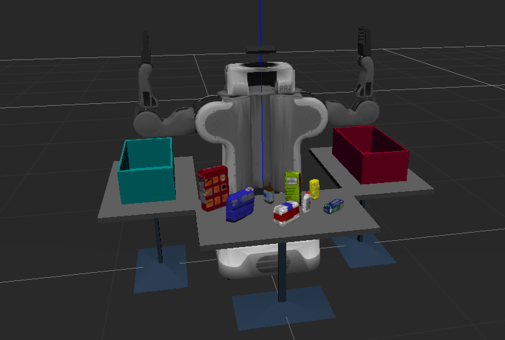
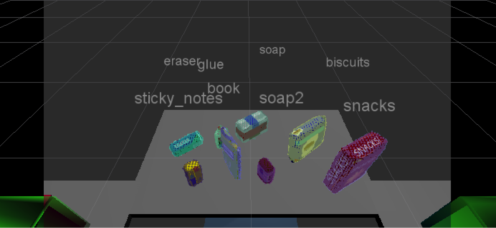
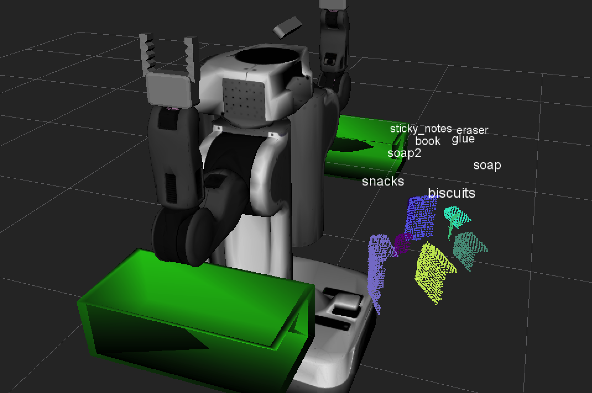

# 3D Perception

## Exercise 1
Pipeline for filtering and RANSAC plane fitting implemented

1. first filter out the outliers
2. voxel grid downsampling
3. passthrough filter
    1. z direction
    2. y direction
4. RANSAC plane detection


## Exercise 2
Pipeline including clustering for segmentation implemented
1. make kd-tree
2. point cluster
3. visualization of the point clouds
4. publish detected objects


## Exercise 3
Features extracted and SVM trained.  Object recognition implemented.

1. use `capture_features.py` to make data for train. I collected 50 different poses data.
```
for i in range(50):
    ...
    # make five attempts to get a valid a point cloud then give up
    sample_was_good = False
    try_count = 0
    while not sample_was_good and try_count < 5:
        sample_cloud = capture_sample()
        sample_cloud_arr = ros_to_pcl(sample_cloud).to_array()

        # Check for invalid clouds.
        if sample_cloud_arr.shape[0] == 0:
            print('Invalid cloud detected')
            try_count += 1
        else:
            sample_was_good = True

    # Extract histogram features
    chists = compute_color_histograms(sample_cloud, using_hsv=True)
    normals = get_normals(sample_cloud)
    nhists = compute_normal_histograms(normals)
    feature = np.concatenate((chists, nhists))
    labeled_features.append([feature, model_name])
```
2. train the model using the kernel `sigmoid`
```
clf = svm.SVC(kernel='sigmoid')
```

## Results
the output files locate in output_files directory. `output_*.yaml` are the required the output file. `model.sav` and `training_set.sav` are generated with sensor\_stick project.

The following are the screen shots in the experiments:



